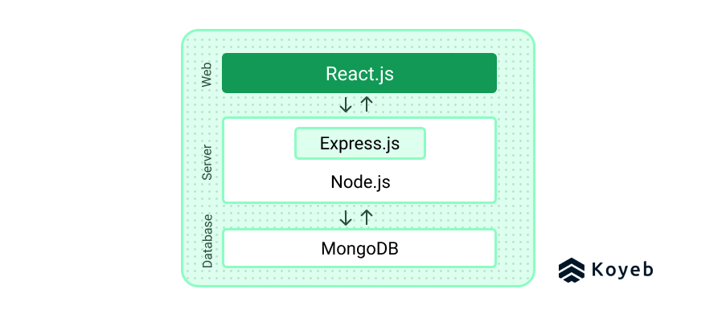

# WilliamOtto_T3A1

[Q1 - Provide an overview and description of a standard source control process for a large project](#q1)

---

[Q2 - What are the most important aspects of quality software?](#q2)

---

[Q3 - Outline a standard high level structure for a MERN stack application and explain the components](#q3)

---

[Q4 - A team is about to engage in a project, developing a website for a small business. What knowledge and skills would they need in order to develop the project?](#q4)

---

[Q5 - With reference to one of your own projects, discuss what knowledge or skills were required to complete your project, and to overcome challenges](#q5)

---

[Q6 - With reference to one of your own projects, evaluate how effective your knowledge and skills were for this project, and suggest changes or improvements for future projects of a similar nature](#q6)

---

[Q7 - Explain control flow, using an example from the JavaScript programming language](#q7)

---

[Q8 - Explain type coercion, using examples from the JavaScript programming language](#q8)

---

[Q9 - Explain data types, using examples from the JavaScript programming language](#q9)

---

[Q10 - Explain how arrays can be manipulated in JavaScript, using examples from the JavaScript programming language](#q10)

---

[Q11 - Explain how objects can be manipulated in JavaScript, using examples from the JavaScript programming language](#q11)

---

[Q12 - Explain how JSON can be manipulated in JavaScript, using examples from the JavaScript programming language](#q12)

---

[Q13 - For the code snippet provided below, write comments for each line of code to explain its functionality. In your comments you must demonstrate your ability to recognise and identify functions, ranges and classes](#q13)

---
---

### Q1

[Top](#williamotto_t3a1)

The standard source control process starts with choosing a system to work with such as Git, or any other distributed source control system. Distributed systems are the standard becaues they enable individual developers to contribute to a project via their own copy of the code, combining these changes in the master. Centralised systems are not used as often as developers all work on the same piece code. This means that distributed systems do not have a single point of failure as each developers changes can be assessed individually among many other benefits.

Within a distributed source control system, lie a few key concepts, the first of which is __source code__. Source code refers to the main code that forms the basis of an application. During the source control process, developers make changes, or copy the source code. A __repository__ is where the source code is stored in its entirety. Developers save their changes locally as a complete copy of this source code which is termed a __clone__ of the remote repository.

A __fork__ is similar to a clone, but is intended to be used when an entirely new piece of software, separate from the original source code.

There are multiple ways a programmer can interact with the source control system. The first and most frequently used action is through the __commit__ command. The commit is used to upload a new version of the code to a repository on top of any previous commits.

The overall structure of the project can be visually represented as a trunk with branches where each commit forms the trunk or a branch. Each branch signifies the development of an individual component of the greater piece of software which is then merged with the latest commit on the trunk otherwise known as the __main branch__. This separation of concerns makes debugging and many other things far easier to manage. This results in that branch, and the main branch becoming the parent commits upon which all subsequent development will be made.

When a developer decides to work on a new branch, they must indicate to the source control system of their intention to add additional features to the software through a __checkout__. Checkouts are simply a way of logging what is being worked on and by whom. This allows multiple developers to work on a single branch simultaneously.

Before any developer can __merge__ a piece of code with the main branch, the team must decide on where and if a branch is going to be merged. Additionally, a distinction should be made about whether the branch is considered a completed feature, or a version intended to be realeased. This would influence whether or not the remote repository is to be merged with the main branch in its entirety or not.

A __fetch__ command is used to retrieve information from other repositories, but does not update anything, it merely informs the local repository that new versions exist.

A __pull__ command is a combination of a fetch and a merge command. It fetches the information from a remote repository, and updates the local repository immediately.

A __push__ command is used to upload any contributions from a local repository to a remote repository.

__References:__
- https://about.gitlab.com/blog/2020/11/19/move-to-distributed-vcs/
- https://www.techtarget.com/searchsoftwarequality/feature/Words-to-go-Version-control-process

---

### Q2

[Top](#williamotto_t3a1)

A piece of well-engineered software should possess the following qualities:

- Reliability:
  - The software should be able to function under typical conditions with consistency. The software must be able to run for the most part, error free. Protocols for error handling should be implemented promptly and efficiently.

- Understandability:
  - The code itself should be well-commented, well-organized, easily maintainble and semantic whilst maintaing dryness. Things to avoid include; abbreviations ('number' instead of 'nr'), be less general when naming classes ('UserManager' instead of 'Manager'), extract functions from code where possible and avoid being repetitive by using tools the language provides. All of these things mentioned serve to simplify the code which makes it easier to understand and modify.

- Modifiability:
  - Code should be able to be changed without a great deal of difficulty. Software where a behaviour of a system can be changed in a time efficient manner is termed a 'flexible' system. Modifiability and flexibility are considered an essential components of well-engineered software.

- Usability:
  - One of the most important aspects of good software is usability. For software to be usable, it needs to allows the user to interact with its core functions without having to seek external help to understand.
  - Comprehensive insctructions are important for software which has more complexity.

- Testability:
  - Being able to verify that the software works in many different use cases is an important aspect of creating well-engineered software.
  - Verification metrics should be available to asses the quality, productivity, progress and health of the testing process.
  - Metrics are important for software testing because measurement is critical in knowing how something has changed relative to a previous test.

- Portability:
  - Portable software should be able to be used on a variety of systems, and in different contexts.
  - Software should be able to run on different operating systems, and different types of hardware.
  - Software that is considered to be highly portable should be able to be reused for different projects and problem domains.

- Efficiency:
  - As physical resources are finite, a well-engineered piece of software should be optimized in order to minimize the use of any associated hardware. Software should be fast to run which is a direct consequence of being efficient.
  - To be efficient, it should consume a small amount of memory, and occupy fewer CPU cycles.
  - Battery consumption is also corellated with this notion of efficiency.

These 7 aspects of software quality are in no particular order of priority. These features should act as a general guideline, however it is up to the discretion of the developers involved to decide what is most important for the project.

__References:__
- https://www.silasreinagel.com/blog/2016/11/15/the-seven-aspects-of-software-quality/
- https://www.geeksforgeeks.org/software-engineering-software-product/
- https://levelup.gitconnected.com/tips-to-improve-code-readability-fa16a9a9f8dc
- https://www.guru99.com/software-testing-metrics-complete-tutorial.html#3

---

### Q3

[Top](#williamotto_t3a1)

The MERN stack consists of four components:

__ReactJS:__

- React is responsible for rendering the front end of the application. It is able to create a dynamic client-side application that renders in HTML to create reusable components which connect to the back end.

__Express.js and Node.js:__

- ExpressJS is a framework that sits on top of Node.js's functionality which simplifies and adds new features to the existing framework. It adds utility to Node.js by allowing the rendering of dynamic HTTP objects. Express.js/Node.js is designed to connect the database with the frontend through the use of object data modellers.

__MongoDB:__

- MongoDB is a no SQL, document oriented database. It's features include its cross-platform compatibility, easy scalability, high availability and high performance. It stores information sent from react as JSON, which is then sent to the backend (express/node), and then entered into the database. This can also be done in reverse, sending query from the databse, and finally being rendered on the screen through React.


This is an image of the MERN stack development


__References:__
- https://www.geeksforgeeks.org/node-js-vs-express-js/
- https://www.koyeb.com/tutorials/get-started-with-the-mern-stack-build-a-blog-with-mongodb-atlas
- https://www.mongodb.com/mern-stack

---

### Q4

[Top](#williamotto_t3a1)

This is partially dependent on what the client wants from the website. A minimum requirement to build a website would be a knowledge of HTML and CSS. With this, a simple website could be built but the features wouldn't be dynamic, and wouldn't run at optimal speeds due to its lack of asynchronous rendering making it a less viable option.

Outside of HTML and CSS, a thorough understanding of JavaScript would greatly assist in creating a website that could be sold to a client. In order to create a great user experience, a tool optimized for this would be useful. React is one of the most popular front-end programs specifically designed to work with JavaScript and HTML. With React, you can build a user experience that is dynamic and fast. The user interface through React can be built to be entirely bespoke, tailored to the customers desires.

Beyond having extensive programming knowledge, the team, or at least several members must know how to plan the project, workload and how to track the project's progression. A complete understanding of the agile project management methodology would be very useful in this context.

Teams should also have a firm grasp on how to use version control software. Git being the most popular software is a great option for developers. Learning how to properly use git to contribute to a project i.e. when and where to merge with the remote repo, and how to use git's various functions. An efective Git workflow is called feature branching where developers will work on specific features that branch off of the main branch. This encapsulation allows for better organisation of the project, and makes reverting, or chaning code easier.

Soft skills that should be employed by all members of a team include willingless to learn, or coachability. Other soft skills that should be taken into consideration include; communication, empathy, critical thinking, creativity, and a general attitude directed toward problem solving. Being able to adopt an attitude that includes these skills is essential for a team to function optimally.

__References:__
- https://www.grammarly.com/blog/soft-skills/?gclid=Cj0KCQiAq5meBhCyARIsAJrtdr4ujvtc2gH5ppx5Dp3UDLFrVKuiE5IOx37usQWqAqQdCn7TCU3FR7IaAqlUEALw_wcB&gclsrc=aw.ds
- https://www.freecodecamp.org/news/how-to-use-git-and-github-in-a-team-like-a-pro/
- https://www.atlassian.com/git/tutorials/comparing-workflows

---

### Q5

[Top](#williamotto_t3a1)

Portfolio-T1A2:

This project at the time of construction presented me with multiple hurdles outside of the actual coding that needed to be overcome to make my time working on it more efficient. I had to spend some time trying to plan the project. This was not something that I initually put much emphasis on, but once I realized that my progress was slowed due to my lack of planning, I decided to try again with a more rigorous plan. Wireframing and responsivity were things that I initially overlooked but which proved to be an important part of the planning process.

---

### Q6

[Top](#williamotto_t3a1)

Portfolio-T1A2:

For this project, I had initially intended to create something that was more complicated than I anticipated. The skills that I had developed at the time of construction were not at a level where I could make design choices work. This presented a challenge to the development of the website as I was forced to change my design as I worked which slowed the process down substantially. For future projects I would take the time to ensure that I have a clearer understanding of what is possible taking into consideration my skillset and the time required.

---

### Q7

[Top](#williamotto_t3a1)

Control flow refers to the order in which a computer would execute the code when a program is run. Unless there are explicit instructions from the code to change the order of execution, a program would typically be executed sequentially, i.e from the first to the last line. Many contemporary programming languages will incorporate features that allow the flow of control to run in an order that can increase execution speed.

JavaScript is a language that supports the use of control flow structures. One of the more common control flow structures are __loops__. Loops are statements that iterate over a section of code, and repeat the loop until it can't loop any more, or the condition becomes false. The most common type of loop is a __for__ loop. This type of loop is conditional, meaning that it will continue to loop until the condition becomes false. Provided the condition remains true, the loop will not stop.

__References:__
- https://developer.mozilla.org/en-US/docs/Glossary/Control_flow
- https://medium.com/@rianna.cleary/control-flow-in-javascript-9c63d0c98bb9#:~:text=Control%20flow%20in%20JavaScript%20is,loops%2C%20conditionals%2C%20or%20functions.

---

### Q8

[Top](#williamotto_t3a1)

Type coercion refers to the way in which one data type can be converted to other data types. This can be either a primitive or an object. Type coercion happens automatically, i.e it is implicit. This is in contrast to type conversion where to change date types, the developer can be explicit or implicit.

JavaScript is considered a weakly-typed language which means that it performs type coercion automatically where applicable. JavaScript can also perform implicit type conversion, otherwise known as type casting.

There are 3 types of coercion in JavaScript; to string, to boolean and to number. 

```
var a = "7";
var b = 11;
var c = a + b;
console.log(z);

// Outputs 18 as an integer
```

In this example, JavaScript performs type coercion to a, converting it to a number before adding it to b. The output c would be an integer.

JavaScript 

__References:__
- https://developer.mozilla.org/en-US/docs/Glossary/Type_coercion
- https://www.freecodecamp.org/news/js-type-coercion-explained-27ba3d9a2839/

---

### Q9

[Top](#williamotto_t3a1)

The term data type refers to the different properties that variables can adopt. It is important to know the distinction between data types and in which contexts any given data type would be useful.

JavaScript being a dynamically typed language means that variables have the ability to change their data type after they have been instantiated. For example:

```
let a = 10 // a is an integer
a = [] // a is an array
a = "Hello, world!" // a is a string
```

There are 8 data types in JavaScript:

1. String
2. Number
3. Bigint
4. Boolean
5. Undefined
6. Null
7. Symbol
8. Object

An object can contain 3 data types; an object, an array and a date.

Here are some examples of different data types in JavaScript:

```
// number:
let a = 3

// string
let greeting = "hello"

// boolean
let c = true

// object
const person = {firstName:"Winnie", middleName:"the", lastName:"Pooh"}

// array object
const students = ["Awakey", "Sleepy", "Dopey"]
```

__References:__
- https://www.w3schools.com/js/js_datatypes.asp

---
### Q10
[Top](#williamotto_t3a1)

An array object allows the storing of multiple items under one variable. Arrays are distinct from primitive data types as they possess certain attributes that make them unique. The following are properties of arrays in JavaScript:

- Arrays can be resized
- Arrays can contain multiple data types
- Elements of an array can only be accessed using non-negative integers
- Arrays are zero-indexed (first element is at index 0)
- A form of array called typed arrays are useful if you intend to ignore the properties of the variables within the array
- When arrays are copied they create shallow copies which means that the contents of the copied array point to the same underlying values as the original array.

Arrays can be manipulated in the following ways:

```
// An array can be declared and instatiated with the following syntax:

const letters = ["a", "b", "c", "d"]

// Access and print a specific element in the array

console.log(letters[2]) // output: "c"

// Add an element at a specific point in the array

letters[4] = "e" // output: ["a", "b", "c", "d", "e"]

// Change an element of the array

letters[4] = "x"
console.log// output: ["a", "b", "c", "d", "x"]
```

The ```arr.length``` property can be used to iterate over the array and access the elements. This is useful in ```for``` loops where the loop will repeat the same number of times as there are elements in the array.

There are several methods that can be used on arrays. join() and push() are two commonly used methods.

```
// join()

// Join elements into a string
let allLetters = letters.join(" ")
// output: "a b c d e"

// push()

// Push elements onto end of array
letters.push("f", "g")
// output: ["a", "b", "c", "d", "e", "f", "g"]
```

__References:__
- https://www.w3schools.com/js/js_arrays.asp
- https://developer.mozilla.org/en-US/docs/Web/JavaScript/Reference/Global_Objects/Array
- https://developer.mozilla.org/en-US/docs/Web/JavaScript/Typed_arrays

---
### Q11
[Top](#williamotto_t3a1)

You can create an object by using an object literal which is formatted as follows:

```
// Example
const employee = {firstName: "John", lastName: "Hamm", email: "john@example.com", position: "front end developer"}
```

Each of these ```name:value``` pairs are called properties. These properties can be accessed in 2 ways:

```
objectName.propertyName
\\ or
objectName["propertyName"]
```
You can also create an object using a contructor function which involves 2 steps:

1. Define the type of object using a constructor function.
2. Use the new method to create an instance of the object.

```
// Example
function Student(id, name, grade) {
  this.id = id
  this.name = name
  this.grade = grade
}

const newStudent = new Student("1234567", "Bill", "6") // new Student object

// Accessing a property:

console.log(`{newStudent.name}`) // output: "Bill"

// Custom methods

function Student(id, name, grade) {
  this.name = name
  this.grade = grade
  id: function() {
    return Math.floor(Math.random()*(2000000-1000000)+1000000); // generates a random studnet id between specified values
  }
}

```

__References:__
- https://www.w3schools.com/js/js_objects.asp
- https://developer.mozilla.org/en-US/docs/Web/JavaScript/Reference/Global_Objects/Object
- https://developer.mozilla.org/en-US/docs/Web/JavaScript/Guide/Working_with_Objects

---
### Q12
[Top](#williamotto_t3a1)

JSON is a form of syntax that is used to serialize data, objects, arrays, strings, numbers, booleans and null. It has a similar appearance to object literals in JavaScript but the requires the use of double quotes around the properties.

One way to manipulate JSON is through the JSON.parse() static method. This method converts a JSON string into a JavaScript object. Below is an example,

```

const jsonExample = `{
  "cars": {
    "toyota-corolla": {
      "make": "toyota",
      "year": "1994",
      "price": "1000",
    }
  }
}`

console.log(JSON.parse(jsonExample) 

// output: converts JSON string to JavaScript object

```

Getting key values from a JSON string can be done with the following methods:

```
Object.keys() // returns keys in an array

Object.values() // returns values in an array

Object.entries() // returns key value pairs in the form [key, value], in an array
```

```
\\ example
const jsonExample = { x: 11, y: 22, z: 33 }

console.log(Object.keys(jsonExample)) // ['x', 'y', 'z']
console.log(Object.values(jsonExample)) // ['11', '22', '33']
console.log(Object.entries(jsonExample)) // [['x', 11], ['y', 22], ['z', 33]]
```

JSONs can be merged using `Object.assign(target, ...sources)`. This merges the arrays from top to bottom, overwriting any values.

```
// example

var array1 = { x: 11, y: 22, z: 33 };
var array2 = { y: 55, z: 66 };
var array3 = { z: 44 };

var merge = Object.assign({}, array1, array2, array3);
console.log(merge); // output: { x: 11, b: 55, c: 44 }
```

__References:__
- https://developer.mozilla.org/en-US/docs/Web/JavaScript/Reference/Global_Objects/JSON
- https://www.geeksforgeeks.org/simple-get-and-post-request-using-fetch-api-method-by-making-custom-http-library/
- https://mossgreen.github.io/JSON-manipulation-with-javascript/

---
### Q13
[Top](#williamotto_t3a1)

```
class Car { // declaring Car class
  constructor(brand) { // constructor method that accepts a brand as an argument
    this.carname = brand; // assigns the brand to the "carname" property
  }
  present() { // a method of the Car class
    return 'I have a ' + this.carname; // If present() method is called, it will return a string.
  }
}

class Model extends Car { // Model class is a subclass of the Car class. Subclasses inherit from parent classes
  constructor(brand, mod) { // constructor method that accepts a brand and mod as arguments
    super(brand); // super method has access to the brand from the car class and passes the brand as an argument from the model constructor method
    this.model = mod; // assigns the mod to the "model" property
  }
  show() { // a method of the model subclass
    return this.present() + ', it was made in ' + this.model; // If show() method is called, it will return a string
  }
}

let makes = ["Ford", "Holden", "Toyota"] // defines an array called "makes" with the values "Ford", "Holden", "Toyota"
let models = Array.from(new Array(40), (x,i) => i + 1980) // defines an array called "models" with the values from 1980 to 2019

function randomIntFromInterval(min,max) { // min and max included
    return Math.floor(Math.random()*(max-min+1)+min); // Generates a random integer between specified min and max values
}

for (model of models) {  // for loop that loops through the models array

  make = makes[randomIntFromInterval(0,makes.length-1)] // returns a random integer between 0 and 2 which is assigned to "make" variable
  model = models[randomIntFromInterval(0,makes.length-1)] // returns a random integer between 0 and 2 which is assigned to "model" variable

  mycar = new Model(make, model); \\ instantiates new Model, assigning to mycar object
  console.log(mycar.show()) \\ prints mycar object using the show() method which will have the output: "I have a ({randomly selected from "Ford", "Holden", "Toyota"}), it was made in ({randomly selected from 1980-1982})"
}
```

__References:__
- 111

[Top](#williamotto_t3a1)